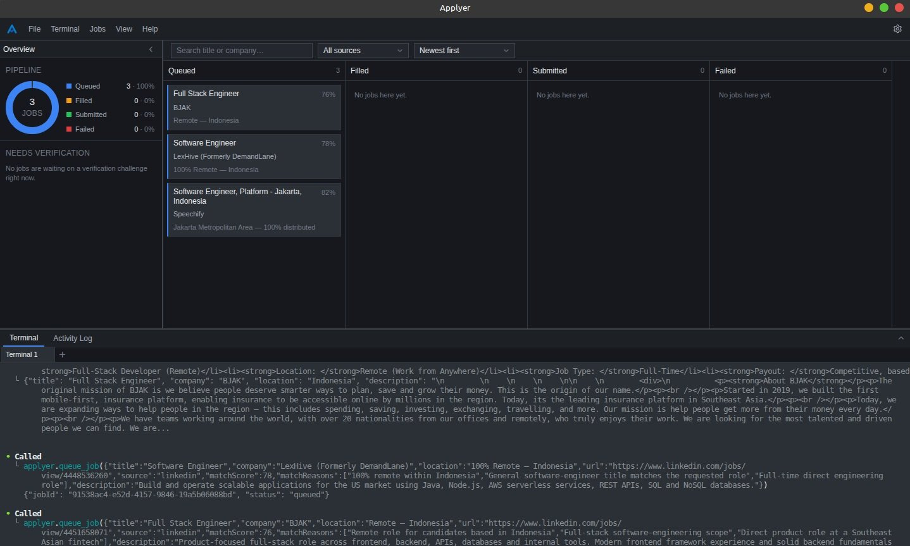

<div align="center">
  

  # Applyer

  **Turn a coding agent into your job-search assistant.**

  A local Electron app that puts Claude Code, Codex CLI, or any other MCP-capable
  agent to work searching, matching, and drafting job applications — while you stay
  in full control of what actually gets submitted.

  [](LICENSE)
  [](package.json)
  [](package.json)
  [](CONTRIBUTING.md)
</div>

---

Applyer runs an embedded terminal alongside a live job board. You describe what you're
looking for, the agent in the terminal searches the web, scores matches against your
profile, queues them, and can even draft a filled-out application — but **it never
clicks submit**. Every application gets a human review before it goes out.

<div align="center">
  
</div>

## Table of contents

- [Why](#why)
- [How it works](#how-it-works)
- [What the agent can do](#what-the-agent-can-do-mcp-tools)
- [Prerequisites](#prerequisites)
- [Setup](#setup)
- [Using it day to day](#using-it-day-to-day)
- [Scripts](#other-useful-scripts)
- [Project status](#is-it-ready-to-use)
- [Contributing](#contributing)
- [License](#license)

## Why

Job hunting is mostly repetitive research: reading postings, checking if they're a real
fit, and filling in the same contact/experience fields over and over. Applyer hands that
repetitive part to a coding agent you already trust to work autonomously in a terminal,
while keeping the parts that actually matter — deciding what to apply to, and hitting
submit — in your hands.

- **You own your data.** Profile and documents live locally, encrypted with your OS
  keychain (or plaintext, your choice) — never sent anywhere except to the agent you
  connect.
- **The agent is sandboxed to a small toolset.** It gets exactly the MCP tools listed
  [below](#what-the-agent-can-do-mcp-tools) — it can't browse your filesystem, run
  arbitrary commands outside its own terminal, or do anything to your machine beyond
  that.
- **Nothing gets submitted without you.** `fill_application` opens a real, visible
  browser window and fills the form. You review it and click submit yourself.

## How it works

1. **Tell it about yourself.** Onboarding walks you through a profile (contact info,
   desired roles, skills, salary expectations) and your resume/cover letter documents.
   You choose whether this is stored encrypted (OS keychain-backed) or plaintext on disk.
2. **Connect an agent.** Onboarding detects installed MCP-capable CLIs (currently
   Claude Code and Codex CLI) and can auto-configure the connection for you, or give you
   a config snippet to add manually.
3. **Ask the agent to job hunt**, from the terminal built into the app. It calls back
   into Applyer over MCP to search, inspect postings, and manage your board.
4. **Review on the board.** Matches land in a Kanban board (Queued → Filled → Submitted,
   plus Failed) that updates live as the agent works.

## What the agent can do (MCP tools)

| Tool | Purpose |
|---|---|
| `get_profile` | Reads your profile and document list, to judge fit and fill forms. |
| `search_jobs` | Keyword search across LinkedIn and Indeed. |
| `get_job_details` | Full posting details for a specific URL (Greenhouse/Lever/Ashby via API, others via headless browser). |
| `queue_job` | Adds a posting to your board (deduplicated by URL). |
| `list_jobs` | Lists what's already on the board, to avoid re-queuing. |
| `flag_failure` | Marks a job Failed with a reason (e.g. login required, listing expired). |
| `fill_application` | Opens a visible browser, fills the standard fields from your profile — never submits. Pauses and surfaces a banner in the app if it hits a verification challenge. |

That's the entire surface area the agent has — nothing else in the app or on your
machine is exposed to it.

## Prerequisites

- Node.js 20+ and npm
- Linux, macOS, or Windows (Linux is what this has actually been built and tested on so
  far)
- At least one MCP-capable CLI installed and authenticated — e.g.
  [Claude Code](https://claude.com/claude-code) (`npm install -g @anthropic-ai/claude-code`)
  or Codex CLI
- On Linux, a display server (X11/Wayland) — the app is a normal Electron GUI app, not
  headless

## Setup

```bash
git clone https://github.com/xCirno1/applyer.git
cd applyer
npm install   # also rebuilds native modules (better-sqlite3, node-pty) for Electron
              # and downloads a bundled Chromium for the agent's browser automation
npm run dev   # launches the app in development mode
```

First launch takes you through onboarding (profile → documents → storage mode → connect
a CLI). This only happens once — subsequent launches go straight to the board.

## Using it day to day

1. Open the app.
2. Go to the **Terminal** tab and start your agent, e.g. type `claude` and hit enter.
3. Ask it something like: *"Search for remote backend engineer roles and queue anything
   that's a good match for my profile."*
4. Switch to the **Board** tab to watch matches show up, open a job for full details, and
   (once the agent has drafted a fill) review and submit the application yourself from
   the browser window it opens.

## Other useful scripts

```bash
npm run build       # production build (out/)
npm run package      # build + package into a distributable (release/) via electron-builder
npm run typecheck    # tsc, no emit
npm run lint          # eslint
npm run test          # unit test suite (Vitest)
npm run test:watch  # unit test suite in watch mode
npm run smoke:mcp    # exercises the MCP server end-to-end against a running dev instance
```

## Is it ready to use?

Yes, for personal, single-user use on Linux. Concretely, what's been verified:

- Full onboarding → profile/documents → storage mode (encrypted or plaintext, switchable
  later from Settings) → MCP connection, working end to end.
- All seven MCP tools pass a scripted protocol smoke test (`npm run smoke:mcp`),
  including validation/error paths, against both dev mode and a packaged build.
- A [Vitest](https://vitest.dev) unit suite (`npm run test`) covers the pure/business
  logic across the app — job-source parsing, MCP schema validation, the MCP tool
  handlers, database repositories (against a real SQLite instance with real migrations,
  not a mock), encryption, MCP CLI adapters, and the renderer's localStorage-backed
  preference logic (theme, shortcuts, workspace layout) and state stores.
- The **packaged app** (`npm run package`) was built, launched standalone, and driven
  through the real MCP bridge exactly as an installed CLI would — including a live
  `search_jobs` call that launched the bundled Chromium and returned real Indeed
  results. Two packaging-specific bugs (a display-server crash in the MCP bridge
  process, and an asar/Playwright incompatibility) were found and fixed this way, not
  just inferred from config.
- Typecheck, lint, and build are all clean.

For getting a coding agent to help you look for jobs on your own machine, it's in good
enough shape to start using today. Treat a packaged build on macOS/Windows as unverified
until someone actually builds and runs one there.

## Contributing

Bug reports, feature ideas, and PRs are welcome — see [CONTRIBUTING.md](CONTRIBUTING.md)
for how to get set up and what to check before opening a PR. Please also read the
[Code of Conduct](CODE_OF_CONDUCT.md).

## License

[MIT](LICENSE)
